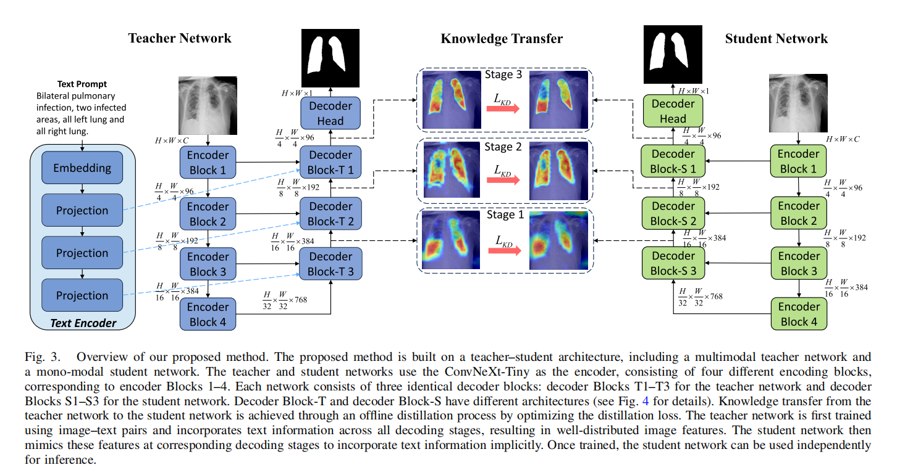

# TextFreeKD-TIM
This repo is the official implementation of "**Text-Driven Medical Image Segmentation With Text-Free Inference via Knowledge Distillation**" [Paper Link](https://ieeexplore.ieee.org/document/10902555)

## Framework Overview


## Requirements
### 1. Environment
The implementation has been tested under the following environment:
```bash
python==3.8  
torch==1.12.1  
torchvision==0.13.1  
pytorch_lightning==1.9.0  
torchmetrics==0.10.3  
transformers==4.24.0  
monai==1.0.1  
pandas  
einops
```
### 2. Pretrained model

CXR-BERT-specialized see: [Link](https://huggingface.co/microsoft/BiomedVLP-CXR-BERT-specialized/tree/main)

ConvNeXt-tiny see: [Link](https://huggingface.co/facebook/convnext-tiny-224/tree/main)

Please download the required pretrained weights and place them in the directories 
specified by `bert_type` and `vision_type` in `config/training.yaml`:

```
MODEL:
  bert_type: ./lib/BiomedVLP-CXR-BERT-specialized
  vision_type: ./lib/convnext-tiny-224
```
## Dataset
1. QaTa-COV19 and MosMedData Datasets(images & segmentation mask)

   The original data can be downloaded in following links: 

   -QaTa-COV19 Dataset-[Link (Original)](https://www.kaggle.com/datasets/aysendegerli/qatacov19-dataset)

   -MosMedData+ Dataset-[Link (Original)](http://medicalsegmentation.com/covid19/) or [Kaggle](https://www.kaggle.com/datasets/maedemaftouni/covid19-ct-scan-lesion-segmentation-dataset)


2. Text Annotations
   
   The text annotations are provided by Li et al. ([Paper Link](https://ieeexplore.ieee.org/document/10172039)) and subsequently refined by Zhong et al. ([Paper Link](https://link.springer.com/chapter/10.1007/978-3-031-43901-8_69)).

   Please check out the related content in [LViT](https://github.com/HUANGLIZI/LViT).

   Thanks for their contributions. If you use these datasets, please cite their work.

3. Format Preparation
   
   Then prepare the datasets in the following format for easy use of the code:

   

```text
├──data
    ├──QaTa-COV19-v2
    │   ├── prompt
    │   │   ├── test.csv
    │   │   └── train.csv
    │   ├── Test
    │   │   ├── GTs
    │   │   └── Images
    │   └── Train
    │       ├── GTs
    │       └── Images
    │
    └── MosMedDataPlus
        ├── prompt
        │   ├── test.csv
        │   └── train.csv
        ├── Test
        │   ├── GTs
        │   └── Images
        └── Train
            ├── GTs
            └── Images
```

## Training

The training process consists of two stages:

### Stage 1: Train the Teacher Network

First, train the teacher model:

```bash
cd Teacher Network
python train.py
```

The trained teacher checkpoint will be saved to `Teacher Network/save_model/medseg.ckpt`

### Stage 2: Train the Student Network with Knowledge Distillation

After training the teacher model, use the saved checkpoint `medseg.ckpt` to train the student model with knowledge distillation.

```bash
cd KD
python train.py
```
## Evaluation

To evaluate a model, please run:

```bash
cd Teacher Network
python evaluate.py
```

or 

```bash
cd KD
python evaluate.py
```

## Citation

If you find this work useful, please cite:

```bibtex
@article{10902555,
  author={Zhao, Pengyu and Hou, Yonghong and Yan, Zhijun and Huo, Shuwei},
  title={Text-Driven Medical Image Segmentation With Text-Free Inference via Knowledge Distillation}, 
  journal={IEEE Transactions on Instrumentation and Measurement}, 
  year={2025},
  volume={74},
  pages={1-15},
  doi={10.1109/TIM.2025.3545506}
  }
```
